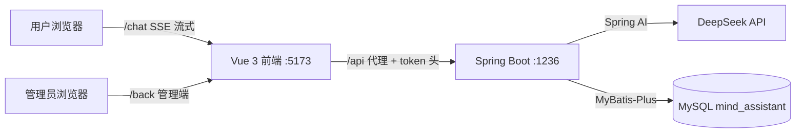

# 心理健康 AI 助手（MindCare AI）

基于 **Spring Boot 3 + Spring AI + Vue 3** 的全栈心理健康平台：用户端与 AI 心理疏导师**流式对话**，管理端提供数据看板、知识库、咨询记录与情绪风险预警。

> 用户端跟 AI 打字机式对话 · 管理端四维数据看板 · JWT 无状态鉴权 · 前后端分离

## 功能特性

**用户端 `/chat`**
- 与 AI 心理疏导师实时对话（SSE 流式响应，打字机效果）
- 多轮上下文记忆（ChatMemory 保留最近 30 条）
- 会话与消息全量落库，支持匿名保密

**管理端 `/back`**
- 数据看板：统计卡片、近 7 日活跃趋势折线图、情绪分布饼图
- 知识文章：分类管理 + 完整增删改查
- 咨询记录：会话检索、风险等级、聊天记录回放
- 情绪日志：情绪分布统计、平均评分（5 分制）、AI 建议关联展示

## 技术栈

| 层 | 技术 |
|---|---|
| 后端 | Spring Boot 3.5 · Spring Security 6 · Spring AI（DeepSeek）· MyBatis-Plus 3.5 · JJWT · Hutool |
| 前端 | Vue 3 · Vite · Element Plus · Pinia · Axios · ECharts |
| 数据库 | MySQL 8（9 张表，见 `mind_assistant(1).sql`） |
| 构建运行 | JDK 17 · Maven · Node 18+ |

## 架构



## 快速开始

### 0. 环境要求

JDK 17 · Maven 3.8+ · Node 18+ · MySQL 8

### 1. 初始化数据库

```sql
CREATE DATABASE mind_assistant DEFAULT CHARACTER SET utf8mb4;
USE mind_assistant;
SOURCE mind_assistant(1).sql;   -- 或用 Navicat 等工具导入
```

### 2. 配置并启动后端（端口 1236）

```bash
cd ai-springboot
# 复制配置模板，填入你的 MySQL 密码与 DeepSeek API Key
cp src/main/resources/application-example.yml src/main/resources/application-local.yml
mvn spring-boot:run -DskipTests
```

> 项目自带 `spring.profiles.active=local`，会自动加载 `application-local.yml`（已被 .gitignore 排除，不会泄露密钥）。

### 3. 启动前端（端口 5173）

```bash
cd code/ai-vue
npm install
npm run dev
```

### 4. 登录体验

浏览器打开 **http://localhost:5173**

| 角色 | 账号 | 密码 |
|---|---|---|
| 演示用户（可对话 AI） | `demo` | `123456` |
| 其他种子用户 | `xiaoyu` / `lilei` 等 | `123456` |

管理端页面：`/back/dashboard`、`/back/knowledge`、`/back/consultation`、`/back/emotional`；用户端 AI 对话：`/chat`。

## 项目结构

```
├── ai-springboot/               # 后端
│   └── src/main/java/com/example/aispringboot/
│       ├── AiService/           # Spring AI：ChatClient 配置、心理疏导服务、结构化输出
│       ├── common/              # Result 统一响应 / PageResult 分页 / 全局异常
│       ├── config/              # SecurityConfig(JWT+ASYNC放行) / ChatClient / MybatisPlus
│       ├── controller/          # User / PsychologicalChat(SSE) / Article / Consultation / EmotionDiary / Dashboard
│       ├── DTO/                 # command(入参) / response(出参) 分层
│       ├── entity/ mapper/      # MyBatis-Plus 实体与 Mapper
│       └── util/                # JWT 工具、认证过滤器、响应工具
└── code/ai-vue/                 # 前端
    └── src/
        ├── api/                 # 按模块封装的 API（含 chat.js 的 fetch+SSE 解析）
        ├── stores/              # Pinia 用户状态
        ├── utils/               # axios 封装（token 头 / 401 拦截）、auth 持久化
        └── views/               # login / chat / dashboard / knowledge / consultation / emotional
```

## 核心接口（节选）

| 方法 | 路径 | 说明 |
|---|---|---|
| POST | `/api/user/login` · `/api/user/add` | 登录 / 注册（JWT） |
| POST | `/api/psychological-chat/session/start` | 创建 AI 咨询会话 |
| POST | `/api/psychological-chat/stream` | **SSE 流式对话**（`text/event-stream`） |
| GET | `/api/dashboard` | 看板聚合（卡片 + 趋势 + 分布 + 最近记录） |
| GET/POST/PUT/DELETE | `/api/article/**` | 知识文章 CRUD + 分类列表 |
| GET | `/api/consultation/page` · `/{id}/messages` | 咨询记录分页 / 聊天回放 |
| GET | `/api/emotion-diary/page` · `/stats` | 情绪日志分页 / 统计聚合 |

## 技术亮点（踩坑实录）

1. **SSE 流式对话完整链路**：Spring AI `ChatClient.stream()` → `Flux<ServerSentEvent>` 打字机推送，`doOnComplete` 将完整回复落库；前端用 fetch + ReadableStream 手动解析 SSE 帧（EventSource 不支持 POST/自定义头）。
2. **Spring Security 6 的 ASYNC 分发坑**：SSE 异步请求完成后 Tomcat 会以 ASYNC 分发再次过安全链，此时 SecurityContext 为空导致 403 吞掉整个流——通过 `dispatcherTypeMatchers(ASYNC, ERROR).permitAll()` 修复。
3. **无状态 JWT 鉴权**：自定义过滤器读取 `token` 请求头、AntPathMatcher 白名单、过期/无效 token 统一返回 401（而非 500）。
4. **MyBatis-Plus 聚合统计复用**：`selectMaps().groupBy` 做情绪分布、`AVG` 做均分，`distributionList()/buildRecords()` 跨 Service 复用，分页统一 `PageResult` 封装。
5. **Vue 3 响应式陷阱**：普通对象 push 进响应式数组后闭包内修改不触发更新，流式渲染必须 `reactive()` 包裹。

## License

MIT
